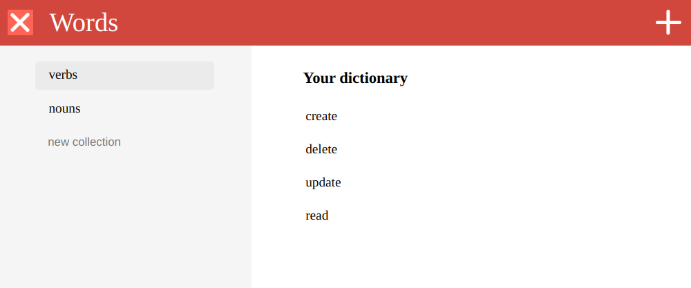

# react-dictionary

In the [React module project](https://github.com/HackYourFuture/React/tree/master/week4) a front-end application for a personal dictionary was built. A user can save words in the browser's memory, gather words into collections, and add translation as a custom field. The application also connects to the public API and requests detailed information at the request of the user.

There were created following pages:
- Home page displays a list of words over the selected collections.
- Word page gives a detailed representation of a chosen word, where users can assign words to collections.
- New word page is a simple form for creating new entries.

[Design reference: Todoist](https://todoist.com/)



## Install

To get started you can simply clone the repo and install the dependencies in the root folder:

```bash
# Clone this repository
$ git clone git@github.com:sergeyzoloto/react-dictionary.git

# Go into the repository
$ cd react-dictionary

# Install dependencies
$ npm install

# Run the app
$ npm start
```

Open [http://localhost:3000](http://localhost:3000) to view it in the browser.

## Demo

[Check it out!](https://react-dictionary-application.netlify.app/)
